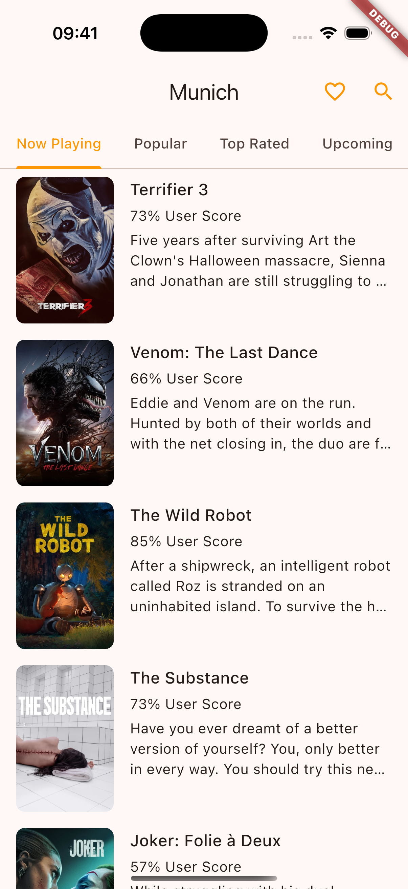
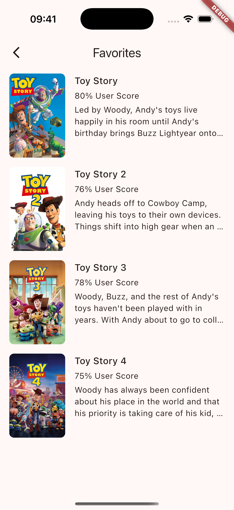
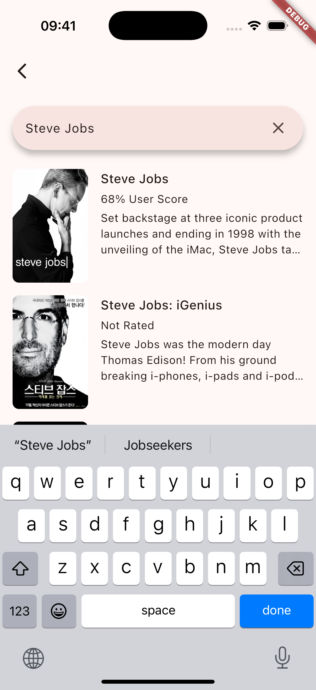

# Munich

**Munich** is a mobile application that uses **The Movie Database API**.

- Dart
- Flutter
- flutter_bloc
- get_it
- go_router
- json_annotation
- json_serializable
- retrofit
- realm

## Screenshots

|        |  |  |
|------------------------------------------|---------------------------------------|-----------------------------------------| 
|  |

